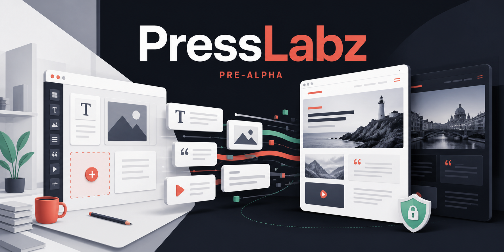

# PressLabz

An open-source, self-hosted content management system for structured, multilingual publishing.

[](https://github.com/shuntps/presslabz/actions/workflows/ci.yml?query=branch%3Amain)
[](LICENSE)


> **Pre-alpha.** There are no releases, no compatibility guarantees, and no production support. Database migrations may still be rewritten before a first release, and anything in this repository can change without notice. Do not run it for a site you care about yet. The roadmap below is a plan, not a promise, and may itself change during pre-alpha.

## What works today

A running installation does all of this now, end to end:

- Sign in with a session the server can revoke, behind rate limiting and Argon2id.
- Write a document out of **typed blocks** — paragraphs, headings, quotes, lists, code, images, dividers — validated by schema, never stored as HTML.
- Upload an image: every file is decoded and re-encoded through sharp. The original upload is discarded; only the AVIF and WebP renditions sharp generated are stored.
- Publish now or on a schedule; scheduled documents go live through the same hooks a manual publication fires.
- Write the translation: each translation is its own document with its own slug and status, linked through a translation group. A French draft can sit behind a published English original.
- Read it on the public site, rendered through a theme, in English or French, in light or dark mode, with a language switcher, reciprocal `hreflang`, a sitemap, feeds, and a robots file.
- Pages are cached in Valkey by tag and purged the moment the content behind them changes.
- Share an unpublished draft through a short-lived signed preview link.
- Restore any of a document's last fifty revisions.

## What is incomplete or future

Incomplete today:

- The editor **preserves** inline marks — links, emphasis, code spans — but cannot **create** one yet: text is written plain until the rich editor arrives.
- Taxonomies are reserved: the tables and their invariants exist, but `defineTaxonomy()` does not, and nothing writes a term.
- Known gaps and defects are tracked in the [issues](https://github.com/shuntps/presslabz/issues).

Future, and always described here as future:

- **Third-party plugin isolation** — the sandbox, the permission manifests and the signed registry are phase 5, the one major phase not started. Until then, every extension is first-party code: nothing makes somebody else's code safe to install.
- **Tiptap**, which is what will let an author create inline marks. It is not installed today.
- **Declarative taxonomies**.
- **Passkeys / WebAuthn and TOTP** — committed to, not written.

## Why

The vocabulary the classic content managers taught the web — a dashboard, themes, plugins, roles and capabilities — is genuinely good. What has aged badly is underneath it: content stored as raw HTML, metadata in an entity-attribute-value table, extensions running with unlimited authority, and neither caching nor translation in the core.

PressLabz keeps the vocabulary and rebuilds the foundations:

- **Content is structured JSON, never HTML.** Every block has a schema and renders through a whitelist renderer, so author-controlled content does not enter a raw-HTML rendering path.
- **Metadata lives in JSONB on the row it describes**, typed per content type, with a GIN index — never in a key-value side table.
- **Plugins will declare capabilities and never hold ambient authority.** The hook API exists and every first-party feature is built on it; the isolation that makes third-party code safe to install is future work, stated above.
- **Cache invalidation is native and tag-based.** Rendering records which content a page read; publishing purges exactly those pages.

## Quick start

Requires Node 24.12+, pnpm 11+ and Docker.

```sh
cp .env.example .env
pnpm install
pnpm services:up      # Postgres, Valkey, object storage — waits until healthy
pnpm db:upgrade       # migrations, then the media reference mirror
pnpm storage:init     # creates the media bucket, once — the API never does
pnpm seed             # first administrator, from SEED_ADMIN_* in .env
pnpm seed:demo        # optional: fixture content in both languages
pnpm dev              # everything at once
```

| Service | Where |
|---|---|
| API (Fastify) | `http://localhost:3000` |
| Admin (React) | `http://localhost:5173` |
| Public site (Astro) | `http://localhost:4321` |

The full command reference is in [`docs/ARCHITECTURE.md`](docs/ARCHITECTURE.md#commands).

## Architecture in brief

One monorepo, one product:

```
apps/api           Fastify REST API: auth, content, media, health, scheduling
apps/admin         React admin — Vite, TanStack Router and Query
apps/web           Astro public site — zero JavaScript by default, reads Postgres directly
packages/core      Content types, capabilities, hooks, shared Zod contracts
packages/blocks    The block vocabulary and its whitelist renderer
packages/db        Drizzle schema, migrations, repositories
packages/cache     Tag-based page cache, shared by the site and the API
packages/i18n      Locale catalogue and message catalogues (en, fr)
packages/tokens    Design tokens, fonts, theme preference machinery
packages/theme-kit The contract a theme satisfies
packages/modules   First-party modules built on the public hook API
themes/default     The theme PressLabz ships with
e2e                Browser tests (Playwright)
```

`docs/ARCHITECTURE.md` is the deep version — conventions, data model, security model, HTTP boundary, caching design, hook API, roadmap. It is kept current with the code, and a mismatch between the two is treated as a defect.

### Extending it

Two shapes, and the difference is the design. An **action** is told that something happened and can change nothing. A **filter** is handed a value and returns one of the same type.

```ts
hooks.action('content:published', async (content) => { /* ... */ })
hooks.filter('content:excerpt', (value) => ({ ...value, excerpt: derive(value.blocks) }))
```

Both are typed, a handler cannot fail the operation that caused it, cannot hang the request, and runs in a decided order. The features PressLabz ships are built on this API rather than beside it — cache invalidation itself is a module with no privileged path into the core.

### Multilingual and theming

Both are core, not add-ons. Translations are first-class rows linked by a group; the interface ships in English and French. Adding an interface language is three changes shipped together: a message catalogue, an entry in the locale list, and a database migration widening the locale constraint.

Light and dark mode are built in — light, dark, or following the system — from one design-token package consumed by the admin and by themes, so a theme overrides values instead of reimplementing theming.

## Stack

What is running is separated from what is committed to.

| Concern | Choice | State |
|---|---|---|
| Core API | Fastify, REST | Running |
| Admin | React, Vite, TanStack Router and Query | Running |
| Public rendering | Astro — zero JavaScript by default | Running |
| Database | PostgreSQL with Drizzle ORM | Running |
| Cache and sessions | Valkey | Running |
| Media | S3-compatible storage, sharp for AVIF and WebP | Running |
| Auth | httpOnly sessions, Argon2id | Running |
| Editor | Custom typed block model | Running — writes plain text; Tiptap is future work and will bring mark creation |
| Auth, second factor | Passkeys / WebAuthn and TOTP | Future — committed to, not written |
| Typed client transport | tRPC | Considered, not adopted — every route is REST today |

Deployment targets self-hosted single-site installations on Node and Docker.

## Development and tests

```sh
pnpm test             # unit and integration suites, against real services
pnpm e2e              # browser tests — their own database, their own servers
pnpm typecheck
pnpm lint
```

Unit, integration and browser suites run in CI on every pull request, along with type checking, linting, manifest invariants, an unused-code audit, CodeQL and dependency review. Exact results live in the [Actions logs](https://github.com/shuntps/presslabz/actions).

## Roadmap

| Phase | Scope | State |
|---|---|---|
| 0 | Monorepo, local services, database schema, design tokens, i18n foundation, CI | Done |
| 1 | Authentication, users, roles and capabilities, admin shell | Done |
| 2 | Content model, block editor, media library, translation linking | Done |
| 3 | Public rendering, theme contract, tag-based cache, language switching | Done |
| 4 | Public hook API, first-party modules built on it | Done |
| 5 | Plugin sandbox, permission manifests, signed registry | The only major phase not started |

Phase 5 being the last *phase* does not mean it is the last of the work: gaps and open issues remain in the capabilities above, and the roadmap itself is not guaranteed complete or stable while the project is pre-alpha.

## Contributing

See [`CONTRIBUTING.md`](CONTRIBUTING.md). The short version: this is a pre-alpha with settled principles — open an issue and talk before building anything substantial, keep code and documentation in English, and treat the documentation as part of the change.

**Design contributors are especially wanted.** PressLabz works, but its visual identity and interface are still evolving — graphic and brand designers, product and UX/UI designers, accessibility specialists, illustrators, design-system and theme designers are all warmly invited. See [Design contributions](CONTRIBUTING.md#design-contributions) for where help would matter and how to start.

## Security

**Please do not open a public issue for a security problem.** Use GitHub's private vulnerability reporting — the **Report a vulnerability** button under the [Security tab](https://github.com/shuntps/presslabz/security) — which keeps the report private until a fix exists. If you cannot use it, email contact@presslabz.com. Details in [`SECURITY.md`](SECURITY.md).

## Licence

Copyright (C) 2026 PressLabz (presslabz.com).

PressLabz is free software under the [GNU Affero General Public License v3.0](LICENSE) (AGPL-3.0-only). You may use, study, modify and share it. If you run a modified version as a network service, the users interacting with it must be offered access to the corresponding source code, under the licence's exact terms. This summary is not legal advice; the [licence text](LICENSE) is authoritative.

## Contact

General enquiries: contact@presslabz.com
